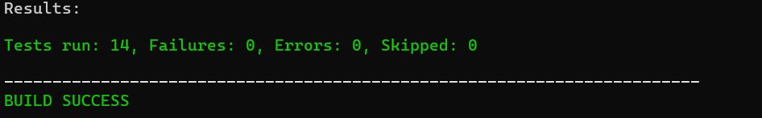

# Budget_Surfers
Εφαρμογή σε JAVA για την ανάλυση των στοιχείων του κρατικού προϋπολογισμού της Ελλάδας

## Απαιτήσεις
**Java JDK/JRE 17+**  
**Maven 3.6+ (Προαιρετικά)**

## Οδηγίες μεταγλώττισης και εκτέλεσης του προγράμματος με jar

1) a) Για περιβάλλον κονσόλας (CLI):  
   i) Κατέβασμα (με απλό κλικ) του αρχείου ```Budget_Surfers-1.0.0-cli.jar``` από τα releases του αποθετηρίου
   και τρέξιμο με:

       bash
       java -jar Budget_Surfers-1.0.0-cli.jar
   Βρισκόμενος/η στον φάκελο όπου κατέβηκε το αρχείο (συνήθως Downloads)

   ή
   
   ii) Κατέβασμα (με απλό κλικ) των αρχείων ```Budget_Surfers-1.0.0-cli.jar``` και ```run-cli.bat``` από τα releases του αποθετηρίου
   και τρέξιμο (με διπλό κλικ) του αρχείου ```run-cli.bat```

    b) Για γραφικό περιβάλλον (GUI):  
    i) Κατέβασμα (με απλό κλικ) του αρχείου ```Budget_Surfers-1.0.0-gui.jar``` από τα releases του αποθετηρίου
    και τρέξιμο με :

        bash
        java -jar Budget_Surfers-1.0.0-gui.jar
     Βρισκόμενος/η στον φάκελο όπου κατέβηκε το αρχείο (συνήθως Downloads)

     ή

     ii) Κατέβασμα (με απλό κλικ) των αρχείων ```Budget_Surfers-1.0.0-gui.jar``` και ```run-gui.bat``` από τα releases του αποθετηρίου
     και τρέξιμο (με διπλό κλικ) του αρχείου ```run-gui.bat```

ή

2)  Αν υπάρχει διαθέσιμη έκδοση Maven 3.6+:  
    Για μεταγλώττιση:

        bash
        mvn clean package (πιο ασφαλές)

    ή

        bash
        mvn package
    Βρισκόμενος/η στον φάκελο root του project δηλαδή στον φάκελο Budget_Surfers
    
    Για εκτέλεση:  
    a) Για περιβάλλον κονσόλας (CLI):

        bash
        java -jar target/Budget_Surfers-1.0.0-cli.jar
     Βρισκόμενος/η στον φάκελο root του project δηλαδή στον φάκελο Budget_Surfers

     b) Για γραφικό περιβάλλον (GUI):

        bash
        java -jar target/Budget_Surfers-1.0.0-gui.jar
     Βρισκόμενος/η στον φάκελο root του project δηλαδή στον φάκελο Budget_Surfers  
   
## Οδηγίες μεταγλώττισης του προγράμματος χωρίς jar

1) a) Για περιβάλλον κονσόλας (CLI):

       bash
       javac -cp target/classes eurozone.gov.excel.Main.java
   Βρισκόμενος/η στον φάκελο root του project δηλαδή στον φάκελο Budget_Surfers
   
   b) Για γραφικό περιβάλλον (GUI):

       bash
       javac -cp target/classes eurozone.gov.excel.BudgetApp.java
      Βρισκόμενος/η στον φάκελο root του project δηλαδή στον φάκελο Budget_Surfers

ή
   
2) Αν υπάρχει διαθέσιμη έκδοση Maven 3.6+:

       bash
       mvn clean compile (πιο ασφαλές)

   ή   

       bash
       mvn compile
   Βρισκόμενος/η στον φάκελο root του project δηλαδή στον φάκελο Budget_Surfers

## Οδηγίες εκτέλεσης του προγράμματος χωρίς jar
Για εκτέλεση:

1) a) Για περιβάλλον κονσόλας (CLI):
       
       bash
       java -cp target/classes eurozone.gov.excel.Main
      Βρισκόμενος/η στον φάκελο root του project δηλαδή στον φάκελο Budget_Surfers

   b) Για γραφικό περιβάλλον (GUI):
   
       bash
       java -cp target/classes eurozone.gov.excel.BudgetApp
      Βρισκόμενος/η στον φάκελο root του project δηλαδή στον φάκελο Budget_Surfers

ή

2) Αν υπάρχει διαθέσιμη έκδοση Maven 3.6+:  
   a) Για περιβάλλον κονσόλας (CLI):
   
       bash
       mvn exec:java -Dexec.mainClass="eurozone.gov.excel.Main"
      Βρισκόμενος/η στον φάκελο root του project δηλαδή στον φάκελο Budget_Surfers

   b) Για γραφικό περιβάλλον (GUI):
   
       bash
       mvn exec:java -Dexec.mainClass="eurozone.gov.excel.BudgetApp"
      Βρισκόμενος/η στον φάκελο root του project δηλαδή στον φάκελο Budget_Surfers

## Οδηγίες χρήσης του προγράμματος
Ο χρήστης έχει 7 βασικές επιλογές και την επιλογή εξόδου από την εφαρμογή.
Εισάγοντας τον αντίστοιχο αριθμό, του εμφανίζονται και οι υποεπιλογές ανάλογα με την αρχική του επιλογή.
Ο χρήστης έχει συνεχώς τη δυνατότητα να επιστρέφει στο προηγούμενο στρώμα επιλογών εισάγοντας τον αριθμό 0.

## Βασικές επιλογές:
- **1**: Προβολή στοιχείων κρατικού προϋπολογισμού
- **2**: Σύγκριση ποσοστιαίων δαπανών ανά τομέα με τον μέσο όρο της Ευρωζώνης
- **3**: Σύγκριση εσόδων και εξόδων τα τελευταία έτη
- **4**: Σύγκριση βιοτικού επιπέδου Ελλάδας με χώρες της Ευρωζώνης
- **5**: Ανάλυση ποσοστιαίων δαπανών ανά περιφέρεια
- **6**: Σύγκριση φορολογικών εσόδων με τον μέσο όρο της Ευρωζώνης
- **7**: Επεξεργασία δεδομένων προϋπολογισμού
- **0**: Έξοδος από την εφαρμογή

## Παρουσίαση της δομής των περιεχομένων του αποθετηρίου
* Budget_Surfers/
    * └── .vscode/
        * └── settings.json
    * └── src/
        * └── main/
            * └── java/eurozone/gov/excel/
                * ├── AvgEurozone.java
                * ├── BudgetApp.java
                * ├── BudgetChange.java
                * ├── BudgetVariance.java
                * ├── ChangeData.java
                * ├── ChangesHistory.java
                * ├── ChildChoices.java
                * ├── Choices.java
                * ├── CompareEuzTaxes.java
                * ├── EuzLivingStandard.java
                * ├── Main.java
                * ├── ReadCsvFiles.java
                * ├── RegionalPer.java
                * └── Subchoices.java
            * └── resources/
                * ├── Gdp_population_euz.csv
                * ├── gr_ministy_25.csv
                * ├── gr_revenue_expenses_25.csv
                * └── logo.png
        * └── test/java/eurozone/gov/excel/
            * ├── TestAvgEurozone.java
            * ├── TestBudgetVariance.java
            * ├── TestChangedData.java
            * ├── TestEuzLivingStandard.java
            * ├── TestEuzTaxes.java
            * └── TestRegionalPer.java
    * ├── .gitignore
    * ├── .htmlhintrc.json
    * ├── checkstyle.xml
    * └── pom.xml
* docs/
    * └── UML_Diagram_For_Budget_Surfers.png
* LICENCE
* README.md


## Διάγραμμα UML σχετικά με το σχεδιασμό του κώδικα
<p align="center">

</p>

## Επισκόπηση των δομών δεδομένων και των αλγορίθμων που χρησιμοποιεί η εφαρμογή
### 1. Δυναμικές Δομές Δεδομένων
Η εφαρμογή χρησιμοποιεί δυναμικές λίστες (`π.χ. ArrayList`) και maps για τη διαχείριση των δεδομένων, εξασφαλίζοντας:

- Ευελιξία: Δυνατότητα αποθήκευσης διαφορετικών τύπων δεδομένων και αντικειμένων.  
- Δυναμική Προσαρμογή: Η δομή μεταβάλλεται ανάλογα με τον όγκο των δεδομένων.  
- Ιστορικότητα: Δυνατότητα παρουσίασης και διαχείρισης ιστορικού προσαρμογών στον χρήστη.

### 2. Σχεσιακή Οργάνωση
Για την καλύτερη οργάνωση και επεξεργασία της πληροφορίας, τα δεδομένα κατανέμονται σε πολλαπλούς πίνακες, κάτι που επιτρέπει:

- Καλύτερη κατηγοριοποίηση των οντοτήτων της εφαρμογής.  
- Ταχύτερη αναζήτηση και φιλτράρισμα των στοιχείων.


## Πρόσθετη Τεκμηρίωση

- Δοκιμές εκτέλεσης (manual tests) έχουν γίνει για όλες τις επιλογές του μενού μέσω του JUnit 5
  
- Η πλειονότητα των μεθόδων είναι σχολιασμένη με σκοπό την αποσαφήνιση της λειτουργίας τους
- Καλύπτονται τα βασικά δεδομένα και υπολογισμοί
- Επιπλέον παραδείγματα CSV βρίσκονται στο repository

